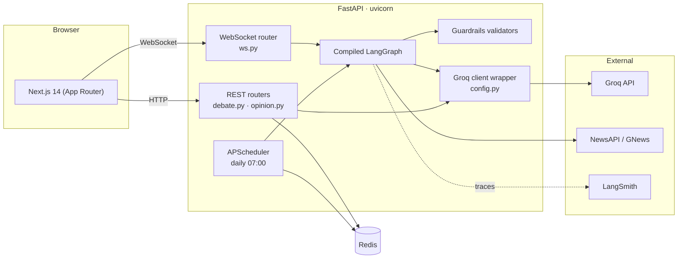
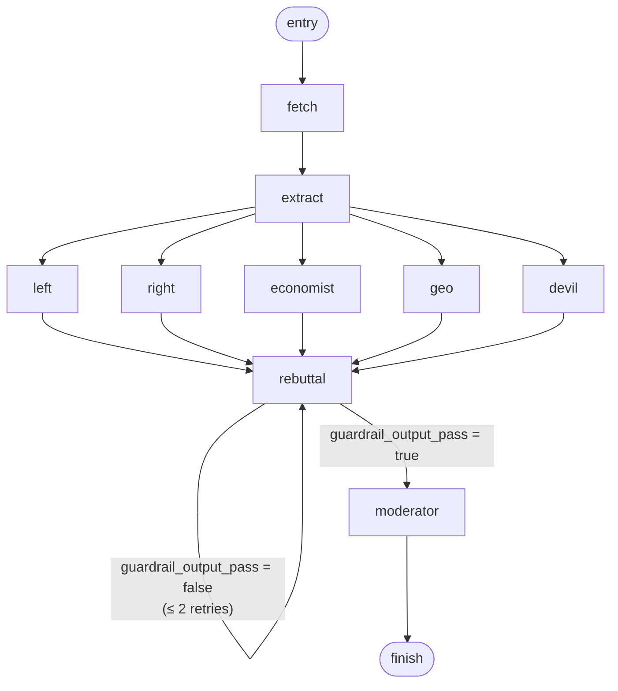
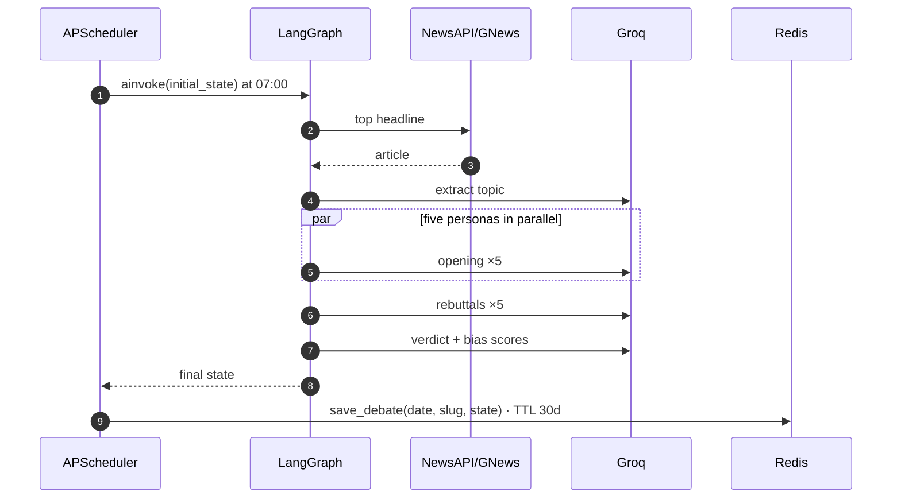
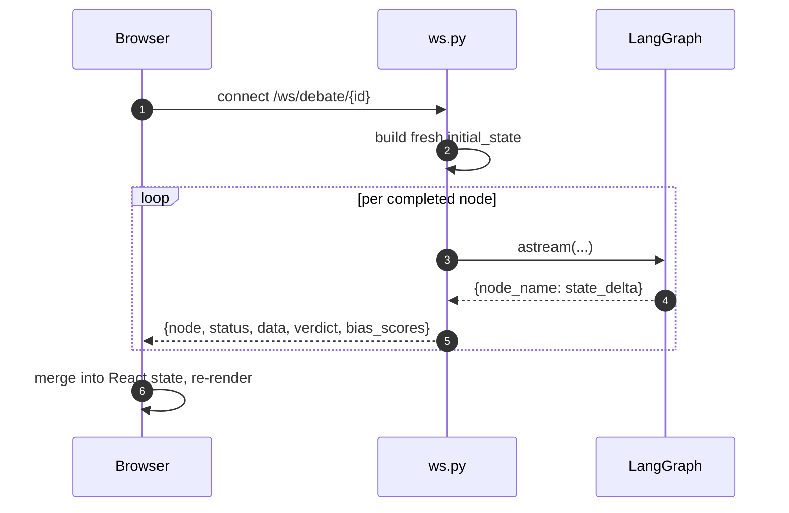
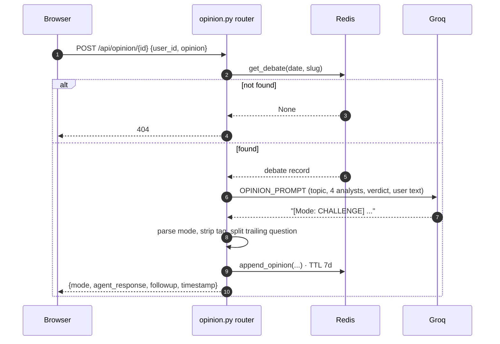
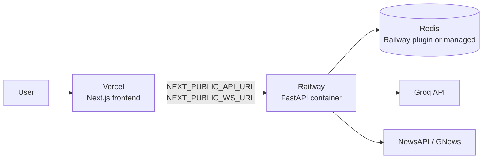

# Architecture

Full technical design of Counterpoint. For setup and usage see
[README.md](README.md).

- [1. Overview](#1-overview)
- [2. System topology](#2-system-topology)
- [3. The debate graph](#3-the-debate-graph)
- [4. Node reference](#4-node-reference)
- [5. State schema and lifecycle](#5-state-schema-and-lifecycle)
- [6. Guardrails layer](#6-guardrails-layer)
- [7. LLM layer](#7-llm-layer)
- [8. Persistence layer](#8-persistence-layer)
- [9. Runtime flows](#9-runtime-flows)
- [10. Frontend architecture](#10-frontend-architecture)
- [11. Observability](#11-observability)
- [12. Configuration reference](#12-configuration-reference)
- [13. Failure modes](#13-failure-modes)
- [14. Deployment topology](#14-deployment-topology)
- [15. Known limitations](#15-known-limitations)

---

## 1. Overview

Counterpoint runs a structured debate between five LLM personas over a single
news story, then synthesizes a verdict and measures how ideologically slanted
each participant was.

Three properties drove the design:

| Goal | Consequence in the architecture |
|---|---|
| Perspectives must be visibly distinct | Personas are separate graph nodes with separate system prompts, not one prompt asking for "multiple viewpoints" |
| The user should watch it happen | The orchestration layer is a state machine that emits per-node deltas, streamed over a WebSocket |
| Generated argument is untrusted text | Validation sits at the pipeline boundaries, and one validator gates a conditional edge |

The backend is one FastAPI process holding three things: the compiled LangGraph
graph, an APScheduler instance, and a Redis client. Nothing else is stateful.

---

## 2. System topology



**Module map**

```
backend/
  main.py                     FastAPI app, CORS, router mounting, startup hook
  scheduler.py                APScheduler cron job + topic slugify + save
  config.py                   Settings (env) + Groq client wrapper (`llm`)
  graph/
    graph.py                  build_graph(): nodes, edges, conditional edge
    state.py                  DebateState TypedDict
    nodes/
      fetcher.py              NewsAPI → GNews, truncation, input guardrail
      extractor.py            article → one-line debate topic
      agents.py               PERSONAS + make_debate_node factory
      rebuttal.py             cross-examination round + output guardrail
      moderator.py            verdict synthesis + bias scoring
      opinion.py              user-opinion agent (outside the graph)
    guardrails/
      input_guard.py          ToxicLanguage + ValidLength
      output_guard.py         ToxicLanguage + DetectPII
  routers/
    debate.py                 GET /api/debates, GET /api/debate/{id}
    opinion.py                POST /api/opinion/{debate_id}
    ws.py                     WS /ws/debate/{id}
  services/
    redis_service.py          key construction, (de)serialization, TTLs
    langsmith_service.py      optional trace context manager
```

Imports are relative within the `backend.` package, which is why the server
must be launched from the project root as `backend.main:app` rather than from
inside `backend/`.

---

## 3. The debate graph



Three structural patterns are doing the work:

**Fan-out.** `extract` has five outgoing edges. The personas share one node
factory (`make_debate_node`) and differ only by the system prompt selected from
the `PERSONAS` dict, so a sixth perspective is a prompt plus two edges.

**Fan-in.** All five personas have an edge into `rebuttal`, which LangGraph
resolves by waiting for every inbound branch to finish before running the node
once. That barrier is what lets each persona see all four opposing arguments.

**Conditional edge.** `rebuttal` is the only branching point:

```python
g.add_conditional_edges("rebuttal",
    lambda s: "moderator" if s["guardrail_output_pass"] else "rebuttal",
    {"moderator": "moderator", "rebuttal": "rebuttal"}
)
```

The retry ceiling is enforced *inside* the node rather than in the predicate:
`rebuttal_node` tracks `_rebuttal_retries` on the state and, once it hits
`MAX_REBUTTAL_RETRIES` (2), sets `guardrail_output_pass = True` so the graph
advances regardless. Without that, a validator that fails deterministically
would loop forever, since regenerating from an unchanged state tends to produce
similar output.

Node names differ from persona keys in one case: the node is registered as
`geo` while the persona key written into state is `geopolitical`.

---

## 4. Node reference

| Node | Reads | Writes | LLM call | Budget |
|---|---|---|---|---|
| `fetch` | — | `news_context`, `date`, `round=1`, `arguments={}`, `rebuttals={}`, `guardrail_input_pass`, `status` | none | — |
| `extract` | `news_context` | `topic`, `status` | 1 | 100 tok |
| persona ×5 | `topic`, `news_context`, `arguments` | `arguments[key]` | 1 each | 400 tok |
| `rebuttal` | `topic`, `arguments` | `rebuttals`, `guardrail_output_pass`, `round=2`, `status` | 5 | 350 tok each |
| `moderator` | `arguments`, `rebuttals`, `topic` | `verdict`, `bias_scores`, `status` | 2 | 500 + 200 tok |

A full run is **13 LLM calls**: 1 extract + 5 openings + 5 rebuttals + 2
moderator (verdict and bias scoring are separate calls so the scoring prompt
can demand strict JSON without constraining the prose verdict).

### fetch

Tries NewsAPI `/v2/top-headlines` (`category=general`, `language=en`,
`pageSize=5`), and falls back to GNews `/v4/top-headlines` when the key is
absent, the request raises `httpx.HTTPError`, or the response has no articles.
Takes the first article, concatenates title + description + content, and
truncates to `MAX_NEWS_CONTEXT_CHARS` (8000 ≈ 2000 tokens) to bound the context
that five agents each pay for.

If neither source yields an article it raises `RuntimeError` — the run aborts
rather than debating an empty topic.

### extract

Collapses the article into one neutral, debatable sentence. This matters
because that sentence is interpolated into all ten subsequent prompts; a
loaded framing here would bias every persona downstream.

### persona nodes

Generated by `make_debate_node(persona_key)`. Each receives the topic, the
article context, and whatever is already in `arguments`. Because the five run
in parallel, in practice that dict is empty for all of them — the devil's
advocate's prompt instructs it to attack the other four positions, but during
round 1 it must anticipate them rather than read them. It gets the real
arguments in the rebuttal round.

### rebuttal

For each persona, builds a prompt containing that persona's own opening plus
the other four (`others` dict), and asks for a defense/counter capped at 150
words. Then joins all five rebuttals and runs the output guardrail over the
combined text, setting `guardrail_output_pass` and the retry counter.

### moderator

Builds a transcript by interleaving each persona's opening and rebuttal, then
makes two calls: a neutral synthesis (≤250 words, explicitly instructed not to
declare a winner), and a bias audit returning JSON mapping persona → 0–1 slant.
The JSON is recovered with a `re.search(r"\{.*\}", ..., re.DOTALL)` and parsed
defensively — on `JSONDecodeError` or no match, `bias_scores` becomes `{}` and
the chart simply renders its empty state rather than failing the run.

---

## 5. State schema and lifecycle

```python
class DebateState(TypedDict):
    topic: str
    date: str
    news_context: str
    round: int
    arguments: dict
    rebuttals: dict
    guardrail_input_pass: bool
    guardrail_output_pass: bool
    verdict: str
    bias_scores: dict
    status: str
```

Every node takes the state and returns it mutated. That uniformity is what
makes the streaming layer trivial: the transport doesn't need to know anything
about which node ran, it just forwards the fields it cares about.

**`status` transitions**

```
fetching ──(fetch)──> fetching ──(extract)──> debating ──(rebuttal)──> rebuttal ──(moderator)──> done
```

The frontend maps each value to a status line. Note the TypedDict comment lists
a `verdict` status that no node actually sets — the moderator goes straight to
`done`.

**Field ownership**

| Field | Written by |
|---|---|
| `news_context`, `date`, `guardrail_input_pass` | `fetch` |
| `topic` | `extract` |
| `arguments[persona]` | that persona's node |
| `rebuttals`, `guardrail_output_pass` | `rebuttal` |
| `verdict`, `bias_scores` | `moderator` |
| `round` | `fetch` (1), `rebuttal` (2) |

`_rebuttal_retries` is written at runtime but is deliberately not declared in
the TypedDict — it's internal bookkeeping, not part of the debate record, and
TypedDict is only statically enforced so the extra key is legal at runtime.

---

## 6. Guardrails layer

Validation is placed at the two boundaries where untrusted text enters or
leaves the pipeline, rather than wrapped around every individual LLM call.

| | Location | Validators | On failure |
|---|---|---|---|
| Input | `fetch` | `ToxicLanguage(threshold=0.3)`, `ValidLength(max=2000)` | Records `guardrail_input_pass=False`; run continues |
| Output | `rebuttal` | `ToxicLanguage(threshold=0.4)`, `DetectPII` | Sets `guardrail_output_pass=False`; graph retries, ≤2 times |

Both are constructed at import time:

```python
input_guard = Guard().use(
    ToxicLanguage(threshold=0.3, on_fail="exception"),
    ValidLength(max=2000, on_fail="fix"),
)
```

The input threshold is stricter (0.3 vs 0.4) because one toxic article
propagates into thirteen downstream calls, whereas a toxic rebuttal affects one
card and is caught by the retry loop.

**Cost of this placement.** The validators are ML-backed: `ToxicLanguage` loads
a detoxify/torch checkpoint (~45MB) and `DetectPII` loads presidio with the
`en_core_web_lg` spaCy model (~400MB). Because the `Guard` objects are module
level, importing `graph.py` transitively loads both models before the ASGI app
can bind its socket — roughly 30s of startup on a warm cache and a
multi-hundred-MB resident footprint. Moving construction behind a lazy
singleton would trade slower first-request latency for faster boot.

---

## 7. LLM layer

All model access goes through one wrapper in `config.py`:

```python
class _LLMWrapper:
    def invoke(self, system: str, user: str, max_tokens: int = 1024) -> str:
        response = _client.chat.completions.create(
            model=settings.GROQ_MODEL_MAIN,
            max_tokens=max_tokens,
            messages=[{"role": "system", "content": system},
                      {"role": "user", "content": user}],
        )
        return response.choices[0].message.content

llm = _LLMWrapper()
```

Every node imports this single `llm` object and calls `.invoke(system=, user=,
max_tokens=)`. The nodes never touch a provider SDK directly, which is what
made the original Anthropic → Groq migration a change to one file plus an
import rename across five call sites; the prompts and graph were untouched.

`GROQ_MODEL_FAST` is configured but not yet used — the intended split is the
cheap model for `extract` and bias scoring, the main model for argumentation.

---

## 8. Persistence layer

```
debate:{YYYY-MM-DD}:{topic-slug}
    HASH    status, topic, news_context, verdict,
            arguments      (JSON string)
            rebuttals      (JSON string)
            bias_scores    (JSON string)
    TTL     30 days

opinions:{YYYY-MM-DD}:{topic-slug}:{user_id}
    LIST    JSON strings: { user_opinion, agent_response,
                            followup, mode, timestamp }
    TTL     7 days
```

The composite key is the debate id the API exposes (`{date}:{topic-slug}`);
routers split it with `split(":", 1)`. Slugs come from
`re.sub(r"[^a-z0-9]+", "-", topic.lower())`, truncated to 60 chars with a
`"topic"` fallback so an empty or punctuation-only topic can't produce an empty
key segment.

Nested dicts are JSON-encoded into hash fields rather than flattened into
separate keys, so a debate is one `HGETALL` and one round trip.

`redis.asyncio` is used throughout and the client is created at module import
with `decode_responses=True`. Connections are lazy, so an unreachable Redis
doesn't prevent startup — it surfaces as a 500 on the first request that
touches it.

`list_debates` does `SCAN` over `debate:*` and then a `get_debate` per key,
sorting the keys in reverse so the newest date sorts first (lexicographic
ordering works because keys are ISO dates).

---

## 9. Runtime flows

### 9.1 Scheduled daily run



Registered in `main.py`'s startup hook as a cron job with
`id="daily_news_debate"` and `replace_existing=True`, so a reload re-registers
rather than duplicating it.

### 9.2 Live streaming run



The payload is uniform for every node:

```python
await websocket.send_json({
    "node": node_name,
    "status": payload.get("status"),
    "data": payload.get("arguments", {}),
    "verdict": payload.get("verdict", ""),
    "bias_scores": payload.get("bias_scores", {}),
})
```

`verdict` and `bias_scores` are included on every frame (empty until the
moderator runs) so the client has one message shape to handle instead of
branching on node name.

Two deliberate notes: the connection **triggers a new debate** rather than
replaying a stored one, and `debate_id` is only a client-side label — it is not
read by the handler. `WebSocketDisconnect` is caught so a client closing
mid-debate doesn't raise.

### 9.3 Opinion submission



This path sits **outside** the graph — it's one call from the route handler,
because it's a single-turn response over an already-finished debate with no
multi-node orchestration to coordinate.

Response parsing in `handle_opinion`:

1. `re.search(r"\[Mode:\s*(AGREE|CHALLENGE|EXPAND)\]", ...)` → mode, defaulting
   to `EXPAND` when the model omits the tag.
2. Strip the tag line from the body.
3. Split on sentence boundaries; if the last sentence ends in `?`, lift it out
   as `followup` so the UI can render it separately in italic.

The prompt gets the left/right/economist/geopolitical arguments and the
verdict, but not the devil's advocate — the counter-arguments come from the
four substantive positions.

---

## 10. Frontend architecture

```
app/
  layout.tsx          fonts (next/font/google), 860px centered shell
  page.tsx            today's debate  → Header + DebateStream
  debate/[id]/page.tsx archived debate → Header + DebateStream
  archive/page.tsx    client-side table + pagination
components/
  DebateStream.tsx    ← owns the WebSocket and all debate state
    AgentStatusDots.tsx
    AgentCard.tsx ×5
    VerdictPanel.tsx
      BiasChart.tsx
    OpinionBox.tsx
      OpinionResponse.tsx
  Header.tsx
  TopicTabs.tsx       built, not currently mounted (one debate/day)
lib/
  api.ts              typed REST client + WebSocket connector
```

`DebateStream` is the only stateful component. It opens the socket in an
effect keyed on `debateId`, closes it on unmount, and holds four pieces of
state: `status`, `args`, `verdict`, `biasScores`. Incoming `data` is merged
(`{...prev, ...event.data}`) rather than replaced, so each persona's card fills
in as it arrives. Status-dot states are derived, not stored — `done` if the run
finished, `active` if that persona has an argument, else `waiting`.

Everything else is presentational and takes props. `api.ts` centralizes the two
base URLs (`NEXT_PUBLIC_API_URL`, `NEXT_PUBLIC_WS_URL`) and exports the
`Debate`, `OpinionResponse`, and `DebateStreamEvent` types shared across
components.

`BiasChart` is hand-rolled divs with percentage widths rather than a charting
library — the design calls for flat 6px bars with no axes, grid, legend, or
title, so a library would have been configuration to remove its own defaults.

Design tokens are CSS custom properties in `globals.css`, mapped into Tailwind
theme colors in `tailwind.config.ts`, so `bg-paper`/`text-ink` resolve through
`var(--paper)`/`var(--ink)` and dark mode is a single
`prefers-color-scheme` block redefining the variables. Animations
(status-dot pulse, response fade-in, tab underline) are defined once and
wrapped in `@media (prefers-reduced-motion: no-preference)`.

---

## 11. Observability

LangGraph nodes are auto-instrumented by LangChain's tracing when
`LANGCHAIN_TRACING_V2=true` and `LANGCHAIN_API_KEY` is set, giving per-node
latency, token cost, prompt, and completion in LangSmith under
`LANGCHAIN_PROJECT`.

`services/langsmith_service.py` adds an optional `trace_run(name, tags)`
context manager for tagging a whole run (for example by date and topic slug).
It degrades to a no-op generator when the SDK is missing or the key is unset,
so tracing is never a hard dependency.

Worth watching per run: cost per persona, latency per node (the five parallel
openings should overlap, not serialize), guardrail pass/fail counts, and the
AGREE/CHALLENGE/EXPAND distribution as a signal of whether the opinion agent is
actually pushing back or just agreeing.

---

## 12. Configuration reference

All settings load from `.env` via `python-dotenv` into a plain `Settings`
class. Every value uses `os.environ.get` with a default, so a missing key
surfaces at call time with a provider error rather than at import.

| Variable | Default | Used by |
|---|---|---|
| `GROQ_API_KEY` | `""` | Groq client |
| `GROQ_MODEL_MAIN` | `llama-3.1-70b-versatile` | every LLM call |
| `GROQ_MODEL_FAST` | `llama-3.1-8b-instant` | reserved |
| `NEWSAPI_KEY` | `""` | `fetch` (primary) |
| `GNEWS_API_KEY` | `""` | `fetch` (fallback) |
| `REDIS_URL` | `redis://localhost:6379` | `redis_service` |
| `LANGCHAIN_TRACING_V2` | `false` | LangChain tracing |
| `LANGCHAIN_API_KEY` | `""` | LangSmith |
| `LANGCHAIN_PROJECT` | `news-debate-system` | LangSmith |
| `SCHEDULER_HOUR` / `SCHEDULER_MINUTE` | `7` / `0` | cron trigger |
| `CORS_ORIGINS` | `http://localhost:3000` | CORS middleware (comma-separated) |
| `NEXT_PUBLIC_API_URL` / `NEXT_PUBLIC_WS_URL` | localhost | frontend |

Non-configurable constants in `config.py`: `MAX_NEWS_CONTEXT_CHARS = 8000`,
`DEBATE_TTL_SECONDS = 30d`, `OPINION_TTL_SECONDS = 7d`.

---

## 13. Failure modes

| Failure | Behavior |
|---|---|
| Both news sources fail | `fetch` raises `RuntimeError`; run aborts, nothing written |
| NewsAPI down or keyless | Silent fallback to GNews |
| Input guardrail fails | Recorded in state; run proceeds |
| Output guardrail fails | Retry rebuttal, ≤2 times, then proceed |
| Bias JSON unparseable | `bias_scores = {}`; chart shows empty state |
| Mode tag missing | Defaults to `EXPAND` |
| Redis unreachable | Startup unaffected; Redis-backed endpoints 500 |
| Debate id not found | 404 from both `GET /api/debate/{id}` and the opinion route |
| Client disconnects mid-stream | `WebSocketDisconnect` caught, generator abandoned |
| Groq rejects the key | Exception propagates as a 500 / WS error |

---

## 14. Deployment topology



The backend image (`backend/Dockerfile`, python:3.11-slim) copies
`backend/` into `/app` and runs `uvicorn backend.main:app` so the package path
matches local development. `CORS_ORIGINS` must include the deployed frontend
origin, and the WebSocket URL must be `wss://` in production.

Because APScheduler runs in-process, the daily job is tied to the backend
container's lifecycle — see limitations.

---

## 15. Known limitations

Honest list of what this design doesn't do yet:

1. **Live runs aren't persisted.** `ws.py` streams the graph but never calls
   `save_debate`, so only the scheduled 07:00 run reaches the archive. A
   completed-run write in the WS handler would fix it.
2. **Every WebSocket connection starts a full debate** — 13 LLM calls. There's
   no check for an existing debate for that date, and `debate_id` from the
   route is ignored. Two browser tabs mean two full runs.
3. **Opinion history is write-only.** `get_opinions` exists in the service
   layer but no route exposes it, so past threads are stored and then
   unreadable.
4. **`list_debates` is `SCAN` + N round trips.** Fine for a 30-day window;
   a sorted set index would be the fix if the archive grows.
5. **The scheduler doesn't survive horizontal scaling.** Every replica would
   fire its own 07:00 job. This needs a distributed lock or an external
   trigger hitting a protected endpoint.
6. **Guardrail models load at import**, adding ~30s to boot and a few hundred
   MB of RSS — awkward on small instances and for cold-start platforms.
7. **`user_id` is client-supplied** (the UI sends `"guest"`). There's no auth,
   so opinion threads aren't really per-user.
8. **One topic per day.** `TopicTabs` is built for multiple, but the pipeline
   fetches a single top headline.
9. **Round 1 is blind.** Parallel fan-out means the devil's advocate can't read
   the arguments it's meant to critique until the rebuttal round; serializing
   it after the other four would cost latency but sharpen it.
