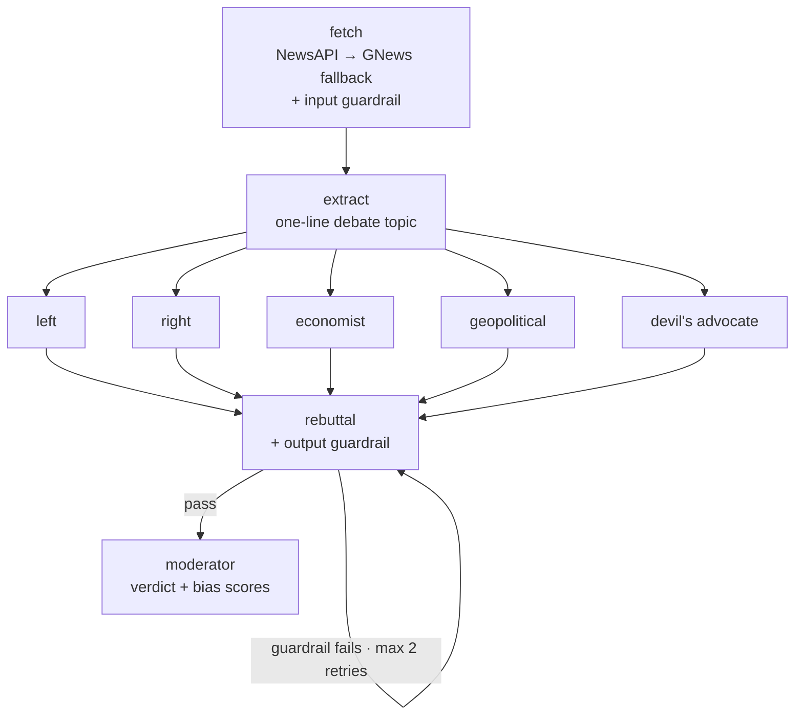

# Counterpoint — Multi-Agent News Debate

Five AI analysts with different worldviews debate the day's top news story, a
moderator synthesizes a bias-balanced verdict, and you can submit your own
opinion to have it challenged or strengthened.

The personas: progressive policy analyst, conservative commentator,
macroeconomist, geopolitical analyst, and a devil's advocate who attacks the
weakest assumptions in all four.

## Motivation

News is consumed passively, and usually through a single ideological lens. The
same event reads completely differently to an economist, a geopolitical
analyst, and commentators on either side of the aisle — but you almost never
see those readings side by side, on the same page, on the same day.

Counterpoint puts them there, then goes one step further: it takes your opinion
and argues with it. Depending on what you write, an agent either strengthens
your position with evidence from the debate, counters it using the analysts'
own arguments, or acknowledges an angle the panel missed.

The goal is an **opinion gym** — something that makes you think harder about
the news rather than just consume more of it.

Two deliberate design choices follow from that:

- **The agents are openly biased, not neutral.** A single "balanced" summary
  hides its assumptions. Five explicit perspectives argue in the open, where
  you can see and weigh them.
- **Bias is measured, not hidden.** After the debate the moderator scores each
  analyst's ideological slant from 0 to 1, rendered as a bar chart, so the
  strength of a case is visibly separate from how one-sided it is.

## Architecture

The debate is a LangGraph state machine. Each node reads and writes one shared
`DebateState` dict, which is what makes streaming possible — every completed
node emits a state delta that the WebSocket forwards to the browser.



**fetch** pulls the top headline from NewsAPI, falling back to GNews if that
fails or returns nothing, and truncates the article to fit the context budget.
**extract** condenses it into a single neutral, debatable topic sentence.

The five personas then run as a **parallel fan-out** — they share the same node
factory and differ only by system prompt, so adding a sixth perspective means
adding a prompt and an edge. They **fan back in** to the rebuttal node, where
each persona sees the other four opening arguments and attacks the weakest
points.

The rebuttal node is the only **conditional edge** in the graph. It validates
all five rebuttals through the output guardrail; on failure it loops back to
itself, capped at two retries before proceeding regardless, so a
persistently-failing validator can't spin forever. The **moderator** then writes
the verdict and scores each persona's slant for the bias chart.

### State

```python
class DebateState(TypedDict):
    topic: str                  # one-line debatable statement
    date: str
    news_context: str           # article text, truncated
    round: int                  # 1 = opening, 2 = rebuttal
    arguments: dict             # { "left": "...", "right": "...", ... }
    rebuttals: dict
    guardrail_input_pass: bool
    guardrail_output_pass: bool
    verdict: str
    bias_scores: dict           # { "left": 0.72, ... }
    status: str                 # fetching | debating | rebuttal | done
```

### Guardrails

Validation sits at both ends of the pipeline, not around individual LLM calls:

- **Input** (in `fetch`): toxicity + length on the fetched article, so a
  poisoned or oversized source never reaches five agents at once.
- **Output** (in `rebuttal`): toxicity + PII detection over the generated
  arguments, gating the conditional edge described above.

### Storage

Redis holds the archive, keyed by date and topic slug:

```
debate:{YYYY-MM-DD}:{topic-slug}     HASH   status, topic, news_context, verdict,
                                            arguments, rebuttals, bias_scores
                                     TTL    30 days

opinions:{YYYY-MM-DD}:{topic-slug}:{user_id}
                                     LIST   { user_opinion, agent_response,
                                              mode, timestamp }
                                     TTL    7 days
```

### Two entry points

The graph runs from either direction:

- **Scheduled** — APScheduler fires daily at 7 AM, invokes the graph, and
  writes the finished debate to Redis for the archive.
- **Live** — a browser opens `WS /ws/debate/{id}`, which streams the graph node
  by node so arguments appear as each analyst finishes rather than in one block
  at the end.

The **opinion agent** sits outside the graph entirely. It's a single call from
the REST route that loads a stored debate, classifies your submission as
AGREE / CHALLENGE / EXPAND, and responds in that mode while citing which
analyst it's drawing on.

## Stack

| Layer | Technology |
|---|---|
| Orchestration | LangGraph (fan-out to 5 agents → rebuttal → verdict) |
| LLM | Groq (Llama 3.1) |
| News | NewsAPI with GNews fallback |
| Guardrails | Guardrails AI (toxicity + length on input, toxicity + PII on output) |
| Storage | Redis (30-day debate archive, 7-day opinion threads) |
| Backend | FastAPI + WebSockets |
| Scheduler | APScheduler (daily 7 AM fetch) |
| Observability | LangSmith (per-node cost, latency, traces) |
| Frontend | Next.js 14 + Tailwind |

## Prerequisites

- Python 3.11+, Node 18+
- A Redis instance (see below)
- API keys: [Groq](https://console.groq.com) (required),
  [NewsAPI](https://newsapi.org) or [GNews](https://gnews.io) (at least one),
  [LangSmith](https://smith.langchain.com) (optional, for tracing)

## Setup

```bash
cd news-debate
python -m venv .venv
.venv\Scripts\activate              # Windows;  source .venv/bin/activate on macOS/Linux
pip install -r backend/requirements.txt

cp .env.example .env                # then fill in your keys
```

### Redis

Either works — the app only cares that `REDIS_URL` points at a reachable Redis.

```bash
docker compose up -d redis
```

If Docker isn't available (or its WSL backend is broken on Windows), run Redis
inside WSL instead:

```bash
wsl -d Ubuntu -u root -- apt-get install -y redis-server
wsl -d Ubuntu -u root -- redis-server --daemonize yes --bind 0.0.0.0 --protected-mode no
wsl -d Ubuntu -- hostname -I        # get the WSL IP
```

Windows→WSL `localhost` forwarding is unreliable, so put that IP in `.env`:
`REDIS_URL=redis://<wsl-ip>:6379`. The IP can change when WSL restarts. Also
note Ubuntu's packaged systemd unit rebinds Redis to `127.0.0.1` only on boot —
`systemctl disable redis-server` if it keeps reverting.

### Run

```bash
uvicorn backend.main:app --reload    # from news-debate/, NOT from inside backend/
```

```bash
cd frontend && npm install && npm run dev   # http://localhost:3000
```

The relative imports in `backend/` resolve as the `backend.` package, so the
backend must be started from the `news-debate/` root.

**First boot is slow (~1–2 min).** The Guardrails validators pull down a ~45MB
toxicity model (detoxify/torch) and a ~400MB spaCy model (`en_core_web_lg`, via
presidio) the first time they're constructed. Both are cached afterwards, so
later restarts take ~30s. Expect this to need a couple of GB of free RAM.

## API

| Endpoint | Purpose |
|---|---|
| `GET /api/debates` | List archived debates |
| `GET /api/debate/{id}` | Full debate: arguments, rebuttals, verdict, bias scores |
| `POST /api/opinion/{debate_id}` | Submit an opinion → agree/challenge/expand response |
| `WS /ws/debate/{id}` | Runs a debate live, streaming each node as it completes |

Interactive docs at `http://localhost:8000/docs`.

## Project layout

```
backend/
  graph/          LangGraph state, nodes (fetcher, extractor, agents,
                  rebuttal, moderator, opinion), and guardrails
  routers/        REST + WebSocket endpoints
  services/       Redis and LangSmith helpers
  config.py       Env vars and the Groq client wrapper
frontend/
  app/            Home (live debate), /debate/[id], /archive
  components/     AgentCard, BiasChart, VerdictPanel, OpinionBox, etc.
```

## Design

A "Classical Minimalist" newspaper aesthetic — Playfair Display headings, Inter
body, JetBrains Mono for data; warm off-white paper; no shadows, gradients, or
rounded corners. Tokens live in `frontend/app/globals.css`, with light/dark
handled by CSS variables.

## Deploying

- **Backend → Railway**: build from `backend/Dockerfile`, set the same env vars
  as `.env`, attach a Redis instance.
- **Frontend → Vercel**: import `frontend/`, point `NEXT_PUBLIC_API_URL` and
  `NEXT_PUBLIC_WS_URL` at the deployed backend.

## Note

`.env` holds live API keys — keep it out of version control. `.env.example` is
the template and should never contain real values.
