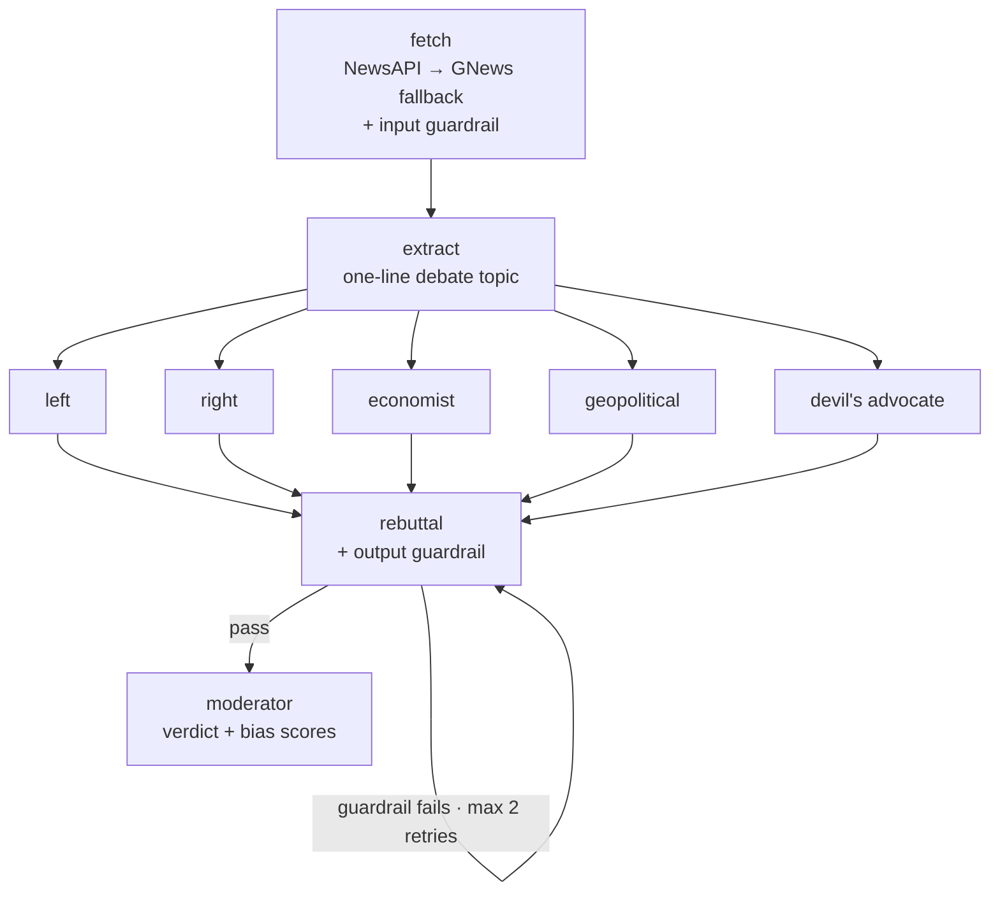

# Counterpoint — Multi-Agent News Debate

Five AI analysts with different worldviews debate the day's top news story, a
moderator synthesizes a bias-balanced verdict, and you can submit your own
opinion to have it challenged or strengthened.

The personas: progressive policy analyst, conservative commentator,
macroeconomist, geopolitical analyst, and a devil's advocate who attacks the
weakest assumptions in all four.

## Motivation

News is consumed passively, and usually through a single ideological lens. The
same event reads completely differently to an economist, a geopolitical
analyst, and commentators on either side of the aisle — but you almost never
see those readings side by side, on the same page, on the same day.

Counterpoint puts them there, then goes one step further: it takes your opinion
and argues with it. Depending on what you write, an agent either strengthens
your position with evidence from the debate, counters it using the analysts'
own arguments, or acknowledges an angle the panel missed.

The goal is an **opinion gym** — something that makes you think harder about
the news rather than just consume more of it.

Two deliberate design choices follow from that:

- **The agents are openly biased, not neutral.** A single "balanced" summary
  hides its assumptions. Five explicit perspectives argue in the open, where
  you can see and weigh them.
- **Bias is measured, not hidden.** After the debate the moderator scores each
  analyst's ideological slant from 0 to 1, rendered as a bar chart, so the
  strength of a case is visibly separate from how one-sided it is.

## Architecture

The debate is a LangGraph state machine. Each node reads and writes one shared
`DebateState` dict, which is what makes streaming possible — every completed
node emits a state delta that the WebSocket forwards to the browser.


```mermaid
flowchart TD
    A["fetch<br/>NewsAPI → GNews fallback<br/>+ input guardrail"] --> B["extract<br/>one-line debate topic"]
    B --> L[left]
    B --> R[right]
    B --> E[economist]
    B --> G[geopolitical]
    B --> D[devil's advocate]
    L & R & E & G & D --> RB["rebuttal<br/>+ output guardrail"]
    RB -->|guardrail fails · max 2 retries| RB
    RB -->|pass| M["moderator<br/>verdict + bias scores"]
```

**fetch** pulls the top headline from NewsAPI, falling back to GNews if that
fails or returns nothing, and truncates the article to fit the context budget.
**extract** condenses it into a single neutral, debatable topic sentence.

The five personas then run as a **parallel fan-out** — they share the same node
factory and differ only by system prompt, so adding a sixth perspective means
adding a prompt and an edge. They **fan back in** to the rebuttal node, where
each persona sees the other four opening arguments and attacks the weakest
points.

The devil's advocate runs after the other four so it can read the arguments it
is meant to attack.

The rebuttal node is the only **conditional edge** in the graph. It validates
each rebuttal through the output guardrail; on failure it regenerates only the
failing ones, capped at two retries (`MAX_REBUTTAL_RETRIES`). Rebuttals that
still fail are **dropped, never published**, and the debate continues with what
passed. The graph also runs with a hard `recursion_limit`, so a stuck loop fails
fast instead of burning LLM calls. The **moderator** then writes the verdict and
scores each persona's slant for the bias chart.

Validation sits at the pipeline boundaries rather than around individual LLM
calls: toxicity and length on the fetched article in `fetch` (a rejected article is
skipped and the next candidate tried), toxicity and PII on rebuttals in
`rebuttal`, and on user opinions and the agent's reply in the opinion endpoint.
If a guardrail can't run at all (missing model, import error) the request fails
rather than passing unchecked; set `GUARDRAILS_ENABLED=false` only for local dev.

The graph is only ever run by the **daily job** (APScheduler at 7 AM, or the
protected `POST /internal/run-daily` for EventBridge/cron/manual kick-offs). A
Redis lock makes it idempotent across replicas and retries, and the fetcher
skips articles debated in the last 14 days. Results are saved to Redis; a
browser opening `WS /ws/debate/{id}` **replays** the stored debate stage by
stage, so viewing a page never triggers LLM calls. The opinion agent
sits outside the graph: a single call that loads a stored debate, classifies
your submission as AGREE / CHALLENGE / EXPAND, and answers in that mode.

📐 **[ARCHITECTURE.md](ARCHITECTURE.md)** has the full design — system
topology, node-by-node reference, state lifecycle, Redis schema, sequence
diagrams for all three runtime flows, frontend component tree, failure modes,
and known limitations.

## Stack

| Layer | Technology |
|---|---|
| Orchestration | LangGraph (fan-out to 5 agents → rebuttal → verdict) |
| LLM | Groq (`openai/gpt-oss-120b` main, `openai/gpt-oss-20b` fast; set via env) |
| News | NewsAPI with GNews fallback |
| Guardrails | Guardrails AI (toxicity + length on input, toxicity + PII on output) |
| Storage | Redis (30-day debate archive, 7-day opinion threads) |
| Backend | FastAPI + WebSockets |
| Scheduler | APScheduler (daily 7 AM fetch) |
| Observability | LangSmith (per-node cost, latency, traces) |
| Frontend | Next.js 14 + Tailwind |

## Prerequisites

- Python 3.11+, Node 18+
- A Redis instance (see below)
- API keys: [Groq](https://console.groq.com) (required),
  [NewsAPI](https://newsapi.org) or [GNews](https://gnews.io) (at least one),
  [LangSmith](https://smith.langchain.com) (optional, for tracing)

## Setup

```bash
cd news-debate
python -m venv .venv
.venv\Scripts\activate              # Windows;  source .venv/bin/activate on macOS/Linux
pip install -r backend/requirements.txt

cp .env.example .env                # then fill in your keys
```

### Redis

Either works — the app only cares that `REDIS_URL` points at a reachable Redis.

```bash
docker compose up -d redis
```

If Docker isn't available (or its WSL backend is broken on Windows), run Redis
inside WSL instead:

```bash
wsl -d Ubuntu -u root -- apt-get install -y redis-server
wsl -d Ubuntu -u root -- redis-server --daemonize yes --bind 0.0.0.0 --protected-mode no
wsl -d Ubuntu -- hostname -I        # get the WSL IP
```

Windows→WSL `localhost` forwarding is unreliable, so put that IP in `.env`:
`REDIS_URL=redis://<wsl-ip>:6379`. The IP can change when WSL restarts. Also
note Ubuntu's packaged systemd unit rebinds Redis to `127.0.0.1` only on boot —
`systemctl disable redis-server` if it keeps reverting.

### Run

```bash
uvicorn backend.main:app --reload    # from news-debate/, NOT from inside backend/
```

```bash
cd frontend && npm install && npm run dev   # http://localhost:3000
```

The site is empty until a debate exists. Generate the first one instead of
waiting for 7 AM (set `ADMIN_TOKEN` in `.env` first):

```bash
curl -X POST -H "X-Admin-Token: $ADMIN_TOKEN" localhost:8000/internal/run-daily
# add ?force=true to run again the same day
```

### Tests

```bash
pip install -r backend/requirements-dev.txt
pytest          # uses fakeredis and a stubbed LLM; no API keys or network needed
ruff check backend && mypy
cd frontend && npm run typecheck && npm run lint && npm test
```

CI (`.github/workflows/ci.yml`) runs all of the above and builds both Docker images.

### Dependencies

`backend/requirements.in` lists the top-level packages; `backend/requirements.txt` is the
pinned lock generated from it (the exact `uv pip compile` command is in its header).
The lock deliberately **excludes torch and its CUDA packages**: install CPU torch separately
with `pip install -r backend/requirements-torch.txt` if you want the real guardrail models
locally. The Docker image does this for you.

The relative imports in `backend/` resolve as the `backend.` package, so the
backend must be started from the `news-debate/` root.

**Turn off Guardrails telemetry.** By default the library reports usage metadata (guard and
validator names, not the text) to a third-party endpoint. It is only controlled by
`~/.guardrailsrc`, so run `printf 'enable_metrics=false\n' > ~/.guardrailsrc` (the Docker image
does this) or `guardrails configure --disable-metrics`. The app logs a warning if it is still on.

**First boot is slow (~1–2 min).** The Guardrails validators pull down a ~45MB
toxicity model (detoxify/torch) and a ~400MB spaCy model (`en_core_web_lg`, via
presidio) the first time they're constructed. Both are cached afterwards, so
later restarts take ~30s. Expect this to need a couple of GB of free RAM.

## API

| Endpoint | Purpose |
|---|---|
| `GET /api/debates?limit&offset` | Archived debate summaries, newest first |
| `GET /api/debate/{id}` | Full debate: arguments, rebuttals, verdict, bias scores |
| `POST /api/opinion/{debate_id}` | Submit an opinion (≤1000 chars, rate-limited) → agree/challenge/expand response |
| `GET /api/opinions/{debate_id}?user_id=` | A user's stored opinion thread |
| `WS /ws/debate/{id}` | Replays a stored debate as `debating` → `rebuttal` → `done` events; closes with code 4404 if not found |
| `POST /internal/run-daily` | Generate today's debate. Requires `X-Admin-Token`; idempotent (`?force=true` overrides) |
| `GET /health`, `GET /health/ready` | Liveness / Redis readiness |

`{id}` is `YYYY-MM-DD:topic-slug`, a bare `YYYY-MM-DD` (newest that day), or
`latest`. Malformed ids return 404.

Interactive docs at `http://localhost:8000/docs`.

## Project layout

```
backend/
  graph/          LangGraph state, nodes (fetcher, extractor, agents,
                  rebuttal, moderator, opinion), and guardrails
  routers/        REST + WebSocket endpoints
  services/       Redis and LangSmith helpers
  config.py       Env vars and the Groq client wrapper
frontend/
  app/            Home (live debate), /debate/[id], /archive
  components/     AgentCard, BiasChart, VerdictPanel, OpinionBox, etc.
```

## Design

A "Classical Minimalist" newspaper aesthetic — Playfair Display headings, Inter
body, JetBrains Mono for data; warm off-white paper; no shadows, gradients, or
rounded corners. Tokens live in `frontend/app/globals.css`, with light/dark
handled by CSS variables.

## Docker

```bash
cp .env.example .env            # fill in the keys
docker compose up --build       # redis + backend :8000 + frontend :3000
```

`docker-compose.override.yml` (picked up automatically) mounts `./backend` and enables
`--reload`; use `docker compose -f docker-compose.yml up` for the production-like stack.
The backend image installs CPU torch and downloads the guardrail models at **build** time
(large image, slow first build), runs as a non-root user, and has a `/health` healthcheck.
Set `LOG_FORMAT=json` (the image default) for one-JSON-object-per-line logs.

## Deploying

**Free, no credit card:** Vercel (frontend) + Hugging Face Space (backend) + Upstash (Redis) +
a GitHub Actions cron for the daily debate. Step-by-step in
**[docs/DEPLOY_FREE.md](docs/DEPLOY_FREE.md)**. The relevant pieces:

- `deploy/huggingface/build_bundle.sh` builds the Space repo (Docker image on uid 1000, port 7860).
- `.github/workflows/deploy-backend.yml` pushes it to your Space; `daily-debate.yml` wakes the
  backend and generates the day's debate (`deploy/scripts/trigger_daily.sh`).
- Frontend: import `frontend/` into Vercel and set `NEXT_PUBLIC_API_URL`.

On any other Docker host: run `backend/Dockerfile` with `REDIS_URL` and the keys from
`.env.example`, and either keep the built-in scheduler (`SCHEDULER_ENABLED=true`) or call
`POST /internal/run-daily` from a cron. `frontend/Dockerfile` builds the site as a container.

## Note

`.env` holds live API keys — keep it out of version control. `.env.example` is
the template and should never contain real values.
